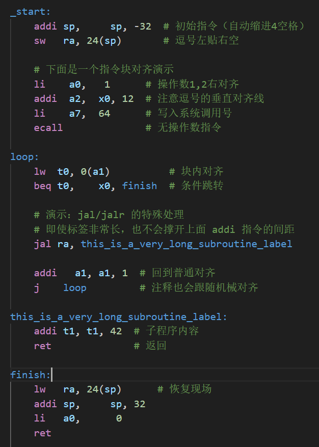
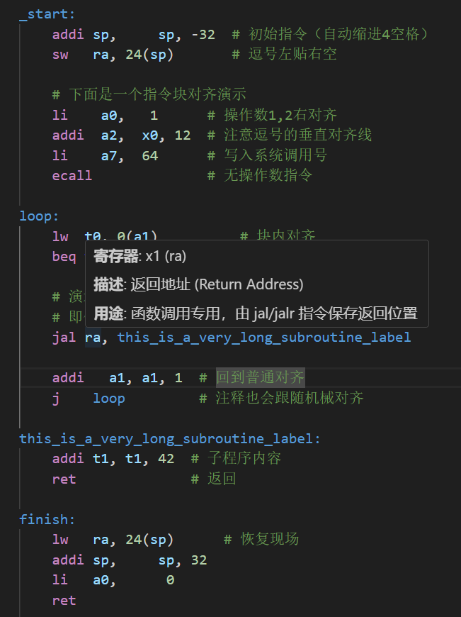
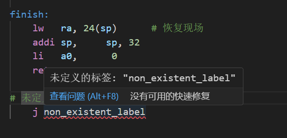
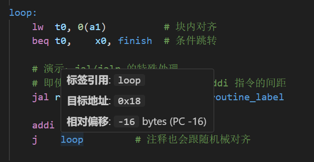

# RISC-V Pro Support for VS Code

一款专门为 RISC-V 汇编开发者做的 VS Code 插件。不光是语法高亮，还加了点真正能提升开发效率的东西。

## 🌟 主要功能

### 1. ⚡ 代码自动对齐 (Formatting)
按 `Shift + Alt + F`，它会自动把你的代码按规范整理好：
* **四列对齐**：指令名、操作数1、操作数2、操作数3 按列对齐，一眼看去干净很多。
* **逗号对齐**：同一个代码块里，所有操作数的逗号都会对齐到同一列，强迫症狂喜。
* **智能跳转处理**：`jal`、`jalr` 后面的长标签不会把普通指令的间距撑开。
* **自动缩进**：标签后面的代码自动缩进 4 个空格，文件开头的配置代码保持顶格不缩。

### 2. 🔍 智能感知与导航 (IntelliSense)
* **代码补全**：支持完整的 RISC-V 指令集（伪指令也带上了），还有 32 个通用寄存器的 ABI 名称。
* **悬停提示**：鼠标放到指令上，会弹窗显示指令含义、操作数格式和相关说明。
* **定义跳转**：`Ctrl + 左键` 点标签，直接跳到定义它的地方。
* **查找引用**：想看某个标签被哪些跳转指令调用过，一键就能查。

### 3. 🛡️ 实时诊断 (Diagnostics)
* **错误检测**：没定义的标签或重复定义的标签，实时给你标出来。
* **逻辑校验**：自动过滤注释和寄存器内容，确保跳转逻辑判断准确。

### 4. 📊 状态栏与大纲 (Utility)
* **内存估算**：状态栏会显示当前文件的指令总数，以及大概会占多少二进制空间。
* **大纲视图**：左侧大纲面板会自动提取文件中所有标签，点一下就能快速跳转，代码长的时候很方便。

---

## 📸 功能截图展示

### 1. 极致对齐效果

*(截取一段包含普通指令和 jal 指令的代码块，展示逗号对齐和注释对齐的效果)*

### 2. 悬停提示与补全

*(鼠标悬停在 `addi` 指令上，弹出带格式的说明文档)*

### 3. 错误实时提醒

*(一个没定义的标签被标了红色波浪线，鼠标移上去会提示具体错误)*

### 4. 状态栏统计

*(状态栏显示了当前文件的指令总数和估算的二进制体积，例如 `$(chip) RISC-V: 20 指令 | ~80 Bytes`)*

### 5. 地址与相对偏移悬停

*(鼠标悬停在指令上会显示该指令的模拟运行地址，悬停在标签上会显示标签对应的地址；如果是跳转指令，还会自动计算并显示目标地址与当前指令的偏移量，如 `beq → 0x10 (+12)`)*

---

## 🛠 怎么用

1. 打开 `.s`、`.asm` 或 `.riscv` 后缀的文件。
2. 试试输入 `addi`，补全提示会自动弹出来。
3. 找一段乱糟糟的代码，按 `Shift + Alt + F`，体验一下一键对齐的快乐。

## 📦 安装方法 (Manual Installation)

由于本插件尚未发布至 Marketplace，请通过以下步骤手动安装：

1. 前往 [Releases](https://github.com/HeNeXeRn/rv32i-highlight/releases) 页面。
2. 下载最新的 `.vsix` 文件。
3. 在 VS Code 中打开扩展面板 (`Ctrl+Shift+X`)。
4. 点击右上角 `...` -> `Install from VSIX...`，选择下载的文件。